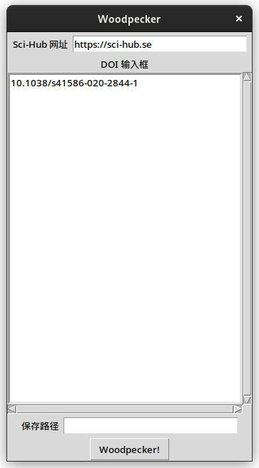
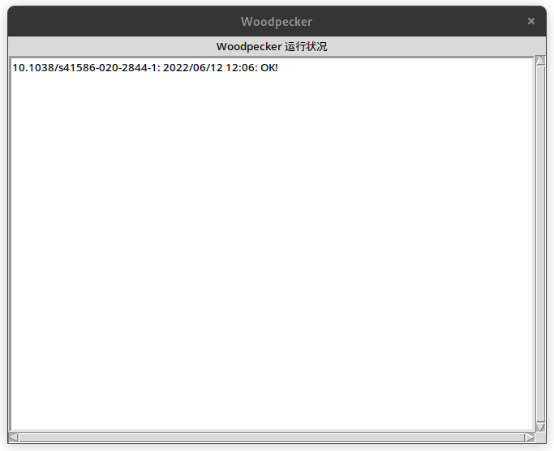

# woodpecker #

根据 DOI 从 [Sci-Hub](https://sci-hub.se) 批量下载文献。

## 使用说明 ##

对于 Windows 平台，建议直接下载release页面中的 EXE 执行文件。

打开软件后会看到界面如下：

在 Sci-Hub 网址栏输入 Sci-Hub 的网址。也可以留空，软件内部记录了几个可以用的网址。

然后在下面的 DOI 栏中输入想要下载的文献的 DOI，每个文献一行。

保存路径中输入想要保存的文件路径，留空代表保存在当前目录，如果选择其他路径，应该保证路径存在。

当下载完成后，会出现信息对话框，记录了哪些文献成功下载，哪些文献下载失败。

